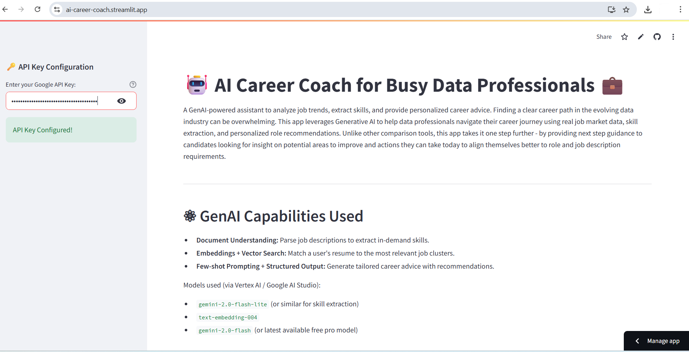
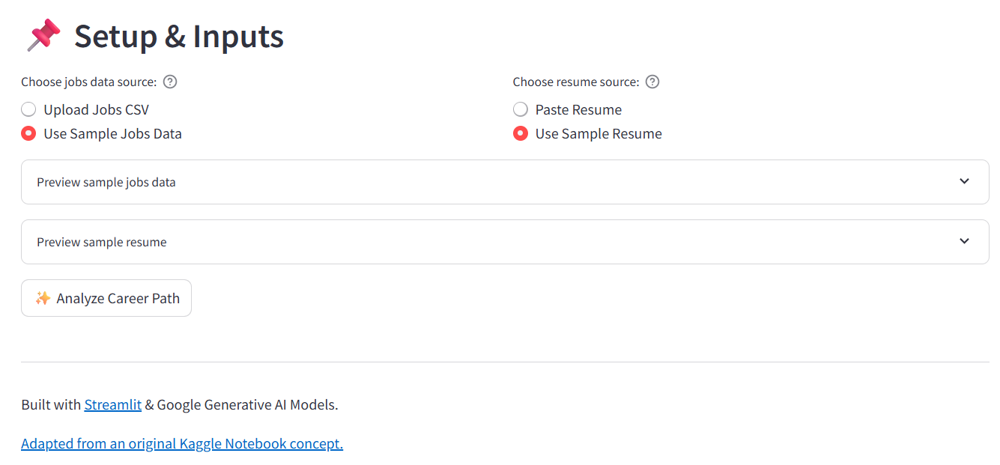
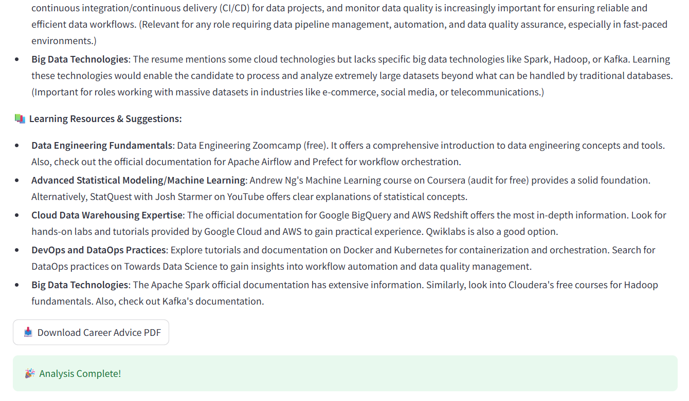

# 🤖 AI Career Coach 💼
Using GenAI to Decode Data Job Trends and Give Personalized Career Advice  
A Streamlit app outgrowth of the Kaggle Google GenAI Capstone Challenge  

[](https://ai-career-coach.streamlit.app/)

### How to run it on your own machine

1. Install the requirements

   ```
   $ pip install -r requirements.txt
   ```

2. Run the app

   ```
   $ streamlit run streamlit_app.py
   ```
3. Paste your free-tier or higher in the Google API Key box in the sidebar on the landing page and hit Enter to begin:  


--- 

4. You have a choice of using existing sample data for analysis or uploading your own:  

--- 

5. AI Career Coach includes a complimentary download of your personalized career advice in convenient .pdf format:  

--- 